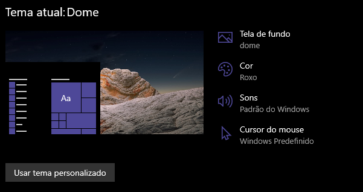

<h1 align="center"> 🎨 Themes for Windows 😄</h1>

    

 <a href="#status">Status</a> • 
 <a href="#objetivo">Objective</a> •
 <a href="#instalacao">Installation</a> • 
 <a href="#tecnologias">Technology</a> • 
 <a href="#autor">Author</a> .
 <a href="#licenca">License</a> • 

<h2 align="center" id=status> 
	:beginner: Concluded :beginner:
</h2>

<h2 id=objetivo>:scroll: Objective</h2>
The aim of the project is to share the themes I use on Windows. 
Dome and Tiger themes are made from the Mac Os wallpapers. 
The Purple theme was made to be more generic. I love that.

Included themes:
- Dome Theme <!-- #6B69D6 -->
- Flamingo Theme <!-- #CC3D29 -->
- Purple Theme <!-- #60548C -->
- Tiger Theme<!-- #5B74A6 --> 

<h2 id=instalacao>:clipboard: Installation</h2>

1. Clone the repo.
2. Go to the "themes" folder
3. Double click on the desired theme

<h2 id=tecnologias>:toolbox: Technology</h2>

The following tools were used in the construction of the project:

- IDE: <a href="https://code.visualstudio.com/download">Visual Studio Code</a>
- Image manipulator: <a href="https://www.gimp.org/downloads/">Gimp</a>

<h2 id=autor>:grin: Author</h2>

Developed by <a href="https://www.linkedin.com/in/danhpaiva/" target="_blank">Daniel Paiva</a>

<h2 id=licenca>:lock: Licence</h2>
<a href="https://github.com/danhpaiva/windows-themes/blob/main/LICENSE" target="_blank">MIT</a>
